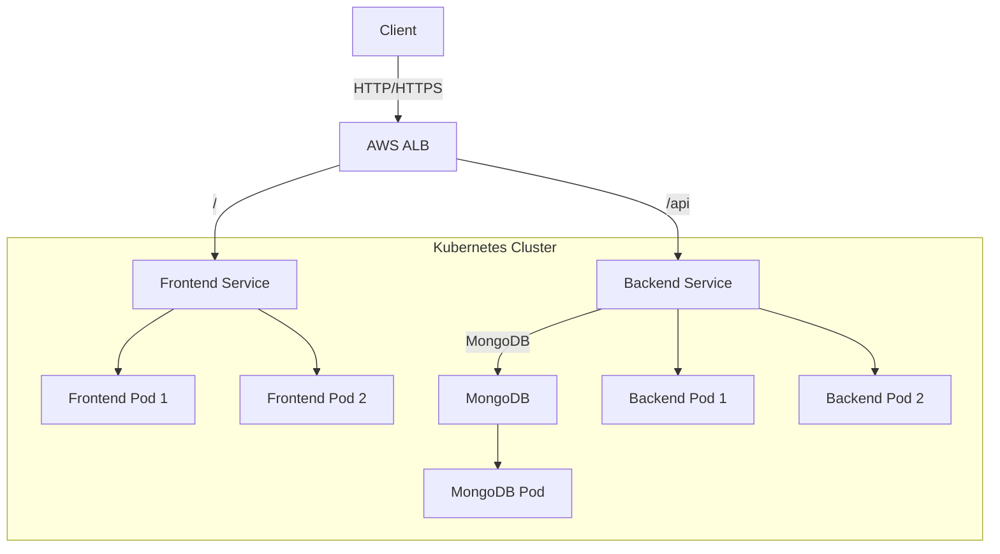

# Yopy - WhatsApp-like Messaging Application

A 3-tier messaging application deployed on Kubernetes (EKS) with the following components:
- Frontend: React application
- Backend: Node.js/Express API
- Database: MongoDB
- Ingress: AWS Application Load Balancer

## Architecture Diagram



## Resource Requirements

### Frontend (2 replicas)
- Requests:
  - Memory: 128Mi
  - CPU: 100m
- Limits:
  - Memory: 256Mi
  - CPU: 200m

### Backend (2 replicas)
- Requests:
  - Memory: 256Mi
  - CPU: 200m
- Limits:
  - Memory: 512Mi
  - CPU: 500m

### MongoDB (1 replica)
- Requests:
  - Memory: 512Mi
  - CPU: 200m
- Limits:
  - Memory: 1Gi
  - CPU: 500m

### Total Minimum Requirements
- Memory: ~1.5GB (1.5Gi)
- CPU: ~1.1 cores

### Recommended Node Size
- Development/Testing:
  - Standard_D2s_v3
  - 2 vCPUs
  - 8 GiB memory

- Production:
  - Standard_D4s_v3
  - 4 vCPUs
  - 16 GiB memory
  - Recommended: 2+ nodes for high availability

## Project Structure
```
yopy/
├── frontend/              # React frontend application
│   ├── src/
│   │   ├── App.js        # Main React component
│   │   └── App.css       # Styling
│   ├── package.json      # Frontend dependencies
│   └── Dockerfile        # Frontend container configuration
│
├── backend/              # Node.js backend application
│   ├── src/
│   │   └── server.js     # Express server
│   ├── package.json      # Backend dependencies
│   └── Dockerfile        # Backend container configuration
│
└── k8s/                  # Kubernetes manifests
    ├── namespace.yaml
    ├── frontend-deployment.yaml
    ├── backend-deployment.yaml
    ├── mongodb-deployment.yaml
    └── ingress.yaml
```

## Prerequisites
- Docker
- Kubernetes cluster (EKS)
- AWS Load Balancer Controller installed
- kubectl configured

## Building and Deploying

1. Build Docker images:
```bash
# Build frontend
cd frontend
docker build -t yopy-frontend:latest .

# Build backend
cd ../backend
docker build -t yopy-backend:latest .
```

2. Deploy to Kubernetes:
```bash
kubectl apply -f k8s/namespace.yaml
kubectl apply -f k8s/mongodb-deployment.yaml
kubectl apply -f k8s/backend-deployment.yaml
kubectl apply -f k8s/frontend-deployment.yaml
kubectl apply -f k8s/ingress.yaml
```

## Features
- Real-time messaging interface
- Username-based chat
- Message history
- Responsive design
- MongoDB for data persistence
- Load balanced across multiple replicas
- AWS ALB for ingress 